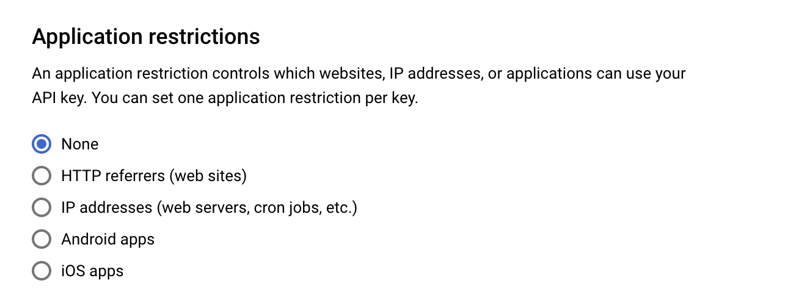
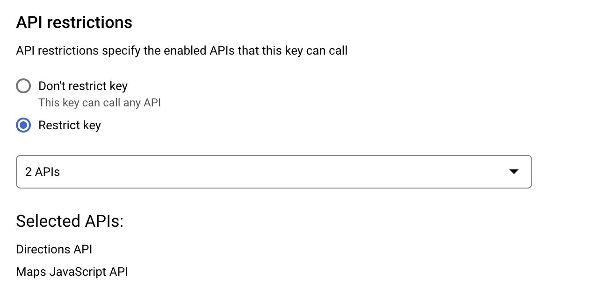
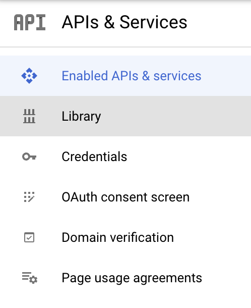
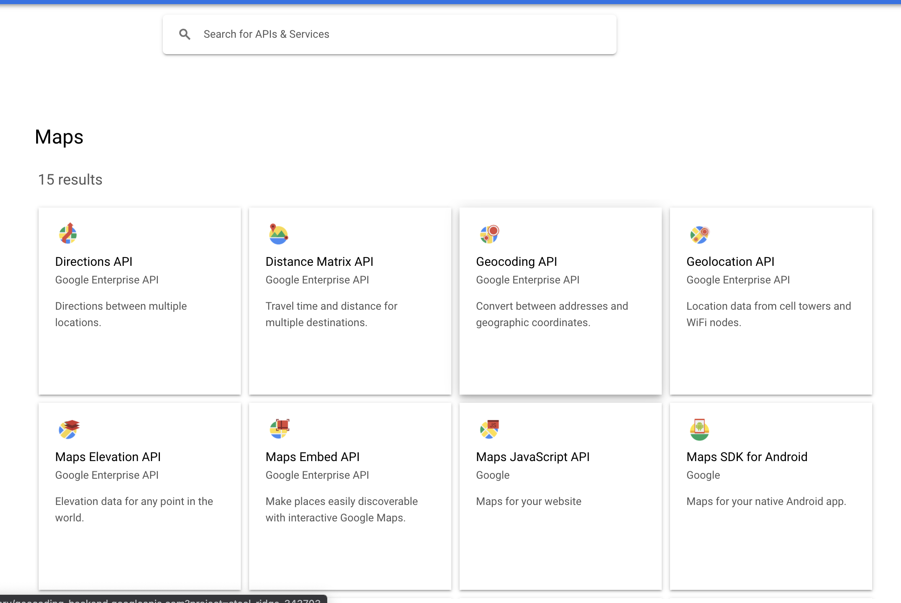
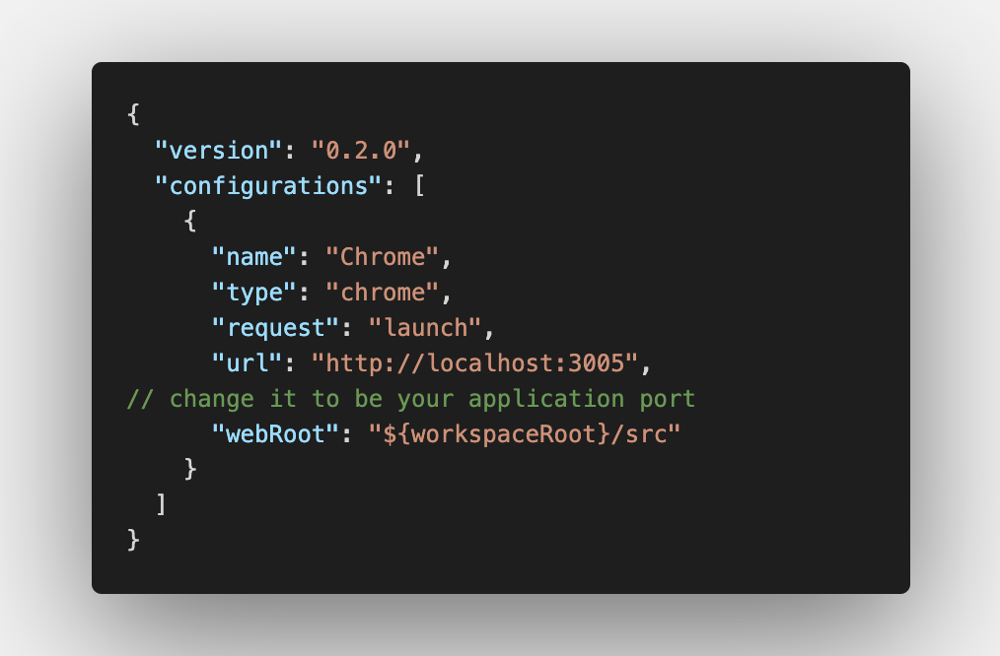
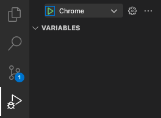

# Getting Started with React GoogleMaps Starter.

## Create google maps key steps

- Open GCP Console ([https://console.cloud.google.com/home]).
- Go to Credential page.
- Click `+ CREATE CREDENTIALS` on the top. And then select `API key`.
- You must get the API key when click create. And then copy it and put to your `.env` file like `REACT_APP_GOOGLE_MAPS_API=<API KEY>`
- You should to click in to your api key for setting your api key.

If you don't any setting the api key it mean this api key can call from all application and it can call all of api.

## Setting restrictions API key

- An application restriction controls which websites, IP addresses, or applications can use your API key. You can set one application restriction per key.

- API restrictions specify the enabled APIs that this key can call

- You need to enable the library before use it.
- Open the library tab by the bar at left side.

- You can select what the api you need to enable on this page.

## Development steps

- To install the packages (first time only to install the packages listed in the package.json.
  - `npm install`
- To start development mode.
  - `npm run dev` || `npm start`
- This project will start application at port 3005 (by default). You also can change the port on .env file by put `PORT=<YOUR PORT>`.
- Open [http://localhost:3005] (http://localhost:3000)(default) to view it in the browser.

The page will reload if you make edits.\
You will also see any lint errors in the console.

## Debugger steps

- Before start if you change the default port you should to change the name in `./.vscode/launch.json` too.
  
- And then open the Run and Debug tab.
- Select Debug to be Chrome .
- You should to run the project (`npm run dev` || `npm start`) before click run on Debug.
  
